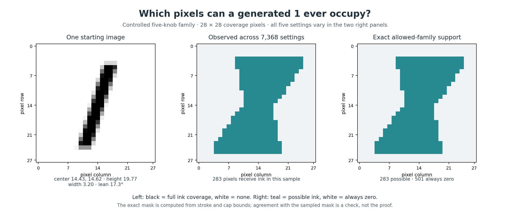
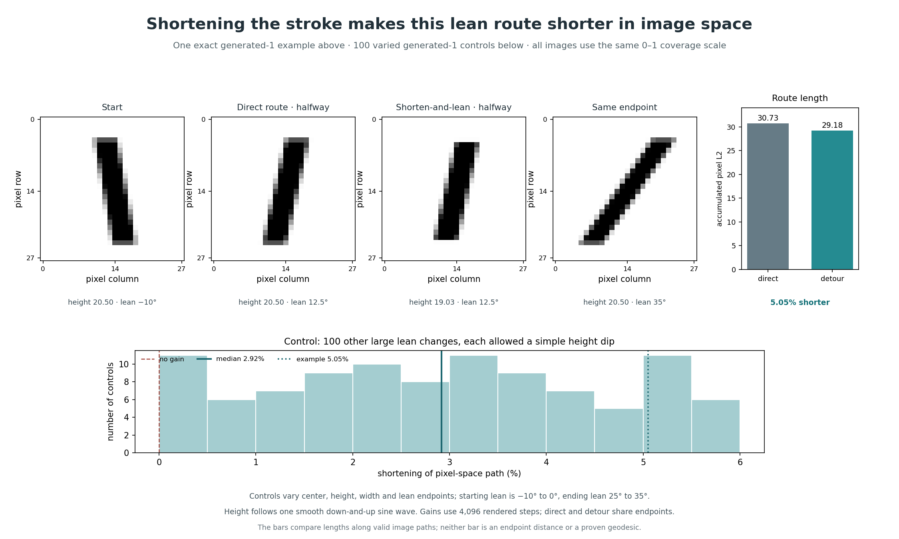

# Generated-one geometry follow-up: whole-family structure and useful routes

This follow-up concerns only the five-knob family in `grey_ones.py`. Its mathematical coverage values are analyzed in float64 before the generator's final float32 cast. All changes are under `claude/`; the earlier experiment is in `GENERATED_GEOMETRY_EXPERIMENTS.md`.

## The whole family occupies an exact 283-pixel support

For each of the generator's 16 horizontal strips per image row, I intersected two requirements:

1. Some allowed vertical center and height must let the stroke reach the strip.
2. At that allowed vertical center, some allowed horizontal center, lean, and width must let the stroke overlap a given pixel column.

The extremes of the horizontal centerline over the remaining knob box occur at its corners. This yields an exact possible-ink mask for the continuous allowed settings. It has 283 pixels. The other 501 image coordinates are exactly zero for every allowed setting. A design of 7,368 settings spanning random, grid, and near-edge cases activated all 283 possible pixels; that is an independent numerical check of the mask.

A direct Python implementation of the float64 coverage rule rounded to precisely the same float32 images as `grey_ones.render` on 400 random settings and all 32 parameter-box corners: zero unequal pixels. The independent twelve-image fixture comparison from the earlier experiment also passed exactly.

## An analytic upper bound of 267 affine dimensions is attained numerically

Rows 6 through 22 are completely inside the stroke vertically for *every* allowed setting. The stroke stays inside the 28 columns horizontally. Consequently, each of these 17 row sums equals the stroke width. Equalizing those row sums gives 16 independent *linear* constraints among the 283 possible pixel coordinates.

Thus the mathematical image family lies in an affine space of dimension **at most 283 − 16 = 267**.

With 4,000 random states alone, I initially found numerical rank 249. That was a sampling failure: a few extreme pixels occurred in only one or two samples. Adding a 5-value grid of every knob (3,125 states) and a 3-value near-edge grid (243 states) activated every possible pixel and raised the measured rank to **267**. The 267th singular value was 0.000249; the 268th was about 2×10⁻¹³. A separate 1,000-state holdout had maximum residual 2.85×10⁻¹⁴ when projected to that 267-dimensional span.

The numerical null space then had dimension 16, and it coincided with the 16 equal-row-ink constraints to about 6×10⁻¹². This joins an exact upper bound with well-separated numerical evidence that the upper bound is attained. It is stronger than reporting a retained-variance percentage. It is still not a symbolic proof that a specific 267-by-267 determinant is nonzero.

The earlier **77** figure remains the numerical affine dimension of one *fixed-center, fixed-lean width-height slice*. It is a different, smaller family.

The same procedure on all ten two-knob slices, fixing the other three knobs at the same reference setting, gave the following numerical affine dimensions. Each used a 61-by-61 grid, 2,000 random settings, and nine near-edge settings. These are slice-specific measurements, not universal ranks for each knob pair.

| Varying pair | Numerical affine dimension |
| --- | ---: |
| Horizontal center, vertical center | 74 |
| Horizontal center, height | 60 |
| Horizontal center, width | 116 |
| Horizontal center, lean | 192 |
| Vertical center, height | 40 |
| Vertical center, width | 92 |
| Vertical center, lean | 178 |
| Height, width | 77 |
| Height, lean | 166 |
| Width, lean | 200 |

The width-lean slice occupies many more ambient directions than the center-height slice because changing lean carries the edge response across many pixel columns. Both slices still have only two independent controls. The results are saved in `pair_slice_results.json`.

## The sharp joins have three mechanisms

I constructed 300 events of each type and compared the five-dimensional tangent spaces on opposite sides as their separation shrank.

| Event | Median largest tangent-space turn | What happens when subrow resolution increases? |
| --- | ---: | --- |
| Stroke cap crosses a **pixel row** | 90° | Remains 90° from 8 to 128 subrows per row |
| Cap crosses a **subrow boundary** within the same pixel row | 0.69° at 16 subrows | Roughly halves with every doubling of resolution |
| Horizontal stroke edge crosses a pixel column at one sampled subrow midpoint | 1.35° at 16 subrows | Vanishes at 32 subrows for the same constructed settings |

The first jump belongs to the pixelized coverage geometry. Just before the crossing, the cap changes pixels in one row; just after it, the cap begins changing pixels in a previously empty row. The one-sided tangent spaces can therefore differ by a right angle while the images themselves remain continuous.

The smaller jumps come from the particular 16-strip quadrature rule: it changes which horizontal profile is sampled as the cap changes strip, or exactly when a sampled stroke edge crosses a column boundary. They are real features of *this implemented generator* but sensitive to its subrow count. Testing the analytic Jacobian at 100 random settings against independent float64 finite differences gave a maximum relative error of 2.64×10⁻⁹.

These tests show why describing the entire generated family as one uniformly smooth five-dimensional surface is too strong. Generic interior patches have five independent tangent directions; event boundaries need one-sided descriptions.

## The geometry is continuous but not uniform in image space

At 3,000 random interior states, the analytic Jacobian had rank five. With each knob scaled so a unit change spans its full allowed range, its smallest singular value ranged from 1.23 to 2.19, and its condition number ranged from 11.8 to 29.8. The local five-dimensional image-volume factor ranged from 2,675 to 10,196, a factor of 3.81.

This is a measurement of the generator's pixel-L2 geometry at uniformly sampled knob settings. It means equal volumes in knob space can occupy quite different image-space volumes. It does not imply any probability distribution for real handwritten images.

## A simple route uses another knob to move less in image space

Take the same start and end except for lean: center (14.5, 14.5), height 20.5, width 4.6, with lean changing from −10° to 35°. The direct path holds all other knobs fixed. A second valid path makes height follow one smooth down-and-up sine wave while lean changes. Its height reaches about 19.03 pixels halfway, then returns to 20.5 at the endpoint. A tiny width dip improves the example by less than 0.001 in length.

Measured with 8,192 rendered steps, the direct path length is **30.7285** in accumulated pixel L2 and the simple detour is **29.1760**, a **5.05% reduction**. Both follow exact allowed knob settings and share endpoints. The path length is measured along the curve, not as the straight 784D distance between endpoint images. Neither route is claimed globally shortest.

I rechecked these same routes using the repository's actual float32 `grey_ones.render` output at 32,768 path steps. The lengths were 30.7287 and 29.1762, still a 5.052% reduction. This checks that final pixel storage precision does not account for the observed advantage at that resolution.

As a control, I generated 100 other large lean changes with centers, heights, widths, and endpoints varied across the allowed settings. For each, I tried nine valid depths of the same sine-shaped height dip. Re-evaluated with 4,096 rendered steps, **all 100** selected detours remained shorter; **83** improved by more than 1%, **17** by more than 5%, and the median improvement was **2.92%**. The smallest gain, 0.040%, should be treated as a measured finite-resolution result. The survey is deliberately restricted to large lean changes; it does not claim the same benefit for every pair of generated 1s.

In 97 of those 100 cases, the best tested dip went all the way to the minimum allowed height of 19 pixels. The gain's sample correlation with available height reduction was 0.85. That supports the reading that shortening the stroke is the active mechanism, while the allowed height boundary limits how far this simple route can exploit it.

This route result makes a hidden degree of freedom operational: height can be used temporarily to make a lean transition cheaper, even when start and end heights agree.

## Reproduce and interpret

- `explore_global_span.py` → `global_span_results.json`: exact support mask, affine upper bound, SVD and holdout.
- `explore_linear_constraints.py` → `linear_constraint_results.json`: numerical null space versus the 16 exact row-sum laws.
- `explore_tangent_events.py` → `tangent_event_results.json`: one-sided direction changes.
- `explore_metric_variation.py` → `metric_variation_results.json`: local stretch and volume variation.
- `explore_pair_slices.py` → `pair_slice_results.json`: ambient spans of all ten two-knob slices.
- `explore_lean_shortcut.py`, `explore_shortcut_control.py`, `explore_shortcut_refine.py`: route example and controls.
- `figure_generated_support.py` and `figure_lean_shortcut.py`: figures rendered and visually inspected at final size.

The old report's exact local patches, their saddle curvature, and the fixed width-height slice remain useful. The new whole-family result explains how many ambient pixel directions those patches collectively use. The route experiment adds a way to ask geometric questions that visibly affect the generated image.

