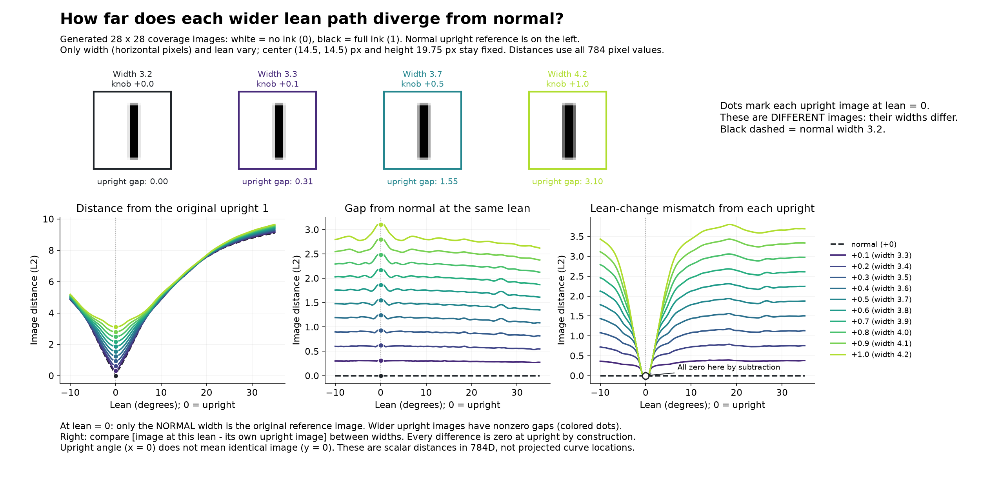
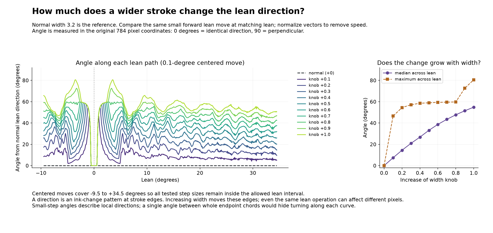
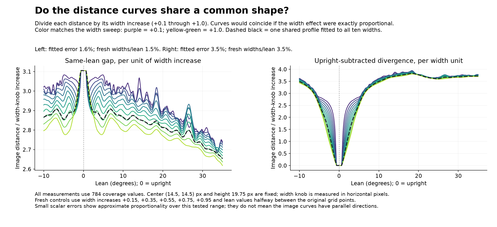

# Corrected width-knob increases and lean paths

The user clarified that "width 1 unit" means increasing the normal width knob, not using an absolute stroke width of 1 pixel.
The earlier run is retained in `literal_one_pixel/` as a historical, superseded interpretation. Its near-90-degree result does not describe the intended +1-width experiment.

## Settings and units

Use the existing native knob: normal width 3.2, then 3.3, 3.4, ..., 4.2, i.e. increases of +0.1 through +1.0. The renderer expresses width in horizontal pixels.
No new 1-to-10 scale is introduced. If one is desired, define the mapping explicitly: the allowed width box 1.8 to 4.6 mapped to 1 to 10 would have step 2.8/9 per unit, which is a different experiment.
All tested widths remain inside the default box. Center is (14.5, 14.5) px, height is 19.75 px, and lean sweeps -10 to +35 degrees. Positive lean tilts the top rightward.
An image is 784 ink coverage values: 0 = no ink, 1 = full ink. Every distance is Euclidean across those coordinates. These are controlled generated strokes, not handwritten MNIST.

## What the distance graphs mean

Write `image(width, lean)` for the full rendered 784-vector. Each colored line fixes width and varies lean.

1. **From the original upright normal 1:** length of `image(width, lean) - image(3.2, 0)`. This includes lean and width changes.
2. **Gap from normal at matching lean:** length of `image(width, lean) - image(3.2, lean)`. This isolates the effect of width at each lean.
3. **Path divergence after upright alignment:** length of `[image(width, lean) - image(width, 0)] - [image(3.2, lean) - image(3.2, 0)]`. This removes the initial offset and compares the effects of lean.
The third graph is zero at upright by construction; this is not an intersection of the original paths. Equal scalar distances in these graphs also do not imply equal images.
Zero divergence everywhere in the third graph would mean the paths were exact translated copies under matching lean. They are not.

## Measured width sensitivity

Angles compare unit-length centered 0.1-degree lean-change vectors at the same lean. Zero degrees means identical forward direction; 90 means perpendicular.
Medians and maxima cover a uniformly sampled -9.5 to +34.5 degree interval, excluding endpoints to accommodate all tested windows.

| Width increase | Width knob | Upright gap | Median same-lean gap | Median direction angle | Maximum direction angle | Maximum aligned divergence |
| --- | --- | --- | --- | --- | --- | --- |
| +0.1 | 3.3 | 0.310 | 0.299 | 7.4 deg | 46.5 deg | 0.392 |
| +0.2 | 3.4 | 0.621 | 0.597 | 14.5 deg | 54.4 deg | 0.789 |
| +0.3 | 3.5 | 0.931 | 0.888 | 20.9 deg | 57.2 deg | 1.179 |
| +0.4 | 3.6 | 1.242 | 1.176 | 26.8 deg | 58.5 deg | 1.561 |
| +0.5 | 3.7 | 1.552 | 1.460 | 33.1 deg | 58.9 deg | 1.938 |
| +0.6 | 3.8 | 1.863 | 1.740 | 38.7 deg | 59.4 deg | 2.312 |
| +0.7 | 3.9 | 2.173 | 2.017 | 43.4 deg | 59.5 deg | 2.685 |
| +0.8 | 4.0 | 2.484 | 2.283 | 47.7 deg | 59.8 deg | 3.059 |
| +0.9 | 4.1 | 2.794 | 2.541 | 51.5 deg | 72.6 deg | 3.433 |
| +1.0 | 4.2 | 3.105 | 2.793 | 54.9 deg | 80.6 deg | 3.801 |

The median direction change grows gradually with width. It depends strongly on lean: around upright the directions nearly coincide for the tested widths, while near some tilted settings even +0.1 produces a much larger angle than its median.
This is compatible with the raster coverage model. Lean changes edge pixels; width moves the edges. As an edge enters a different pixel, the local ink-change pattern can turn sharply. The underlying ideal coverage formula is continuous but only piecewise differentiable, and float32 outputs introduce tiny numerical differences.
These are differences in the fixed pixel coordinate system, not evidence that the semantic operation changed.

## The intended +1 comparison

Normal 3.2 versus increased width 4.2 has same-lean gaps 2.618 to 3.105.
The requested connected 3-unit paths have minimum gap 2.430; the all-pairs 0.05-degree scan of actual generated images has minimum 2.618, both at +35 degrees.
These are different objects: straight segments interpolate coverage vectors and can cut across the curved generated path, leaving the exact generated family.
Small-step direction angle has median 54.9 degrees; connected segment directions at matching lean have median 47.1 degrees.
Arc lengths are 28.769 and 28.755, almost identical. One endpoint-chord angle is only 19.1 degrees, hiding local turning.
On a matched 91-point lean grid, the all-pairs distance matrices differ by 4.67% in relative Frobenius norm after fitting one scale (1.0425). Thus large differences in absolute local direction coexist with comparatively similar internal distance patterns. This is a distance-matrix residual, not a fitted rigid-alignment reconstruction error.
Original curves do not cross. Ink is constant at width times height, 63.2 versus 82.95, and linear interpolation preserves it. Equal coverage vectors cannot have different totals. The same argument applies to every positive tested width increase.

## What dimensionality means here

- Each image has 784 pixel coordinates: ambient space is 784D.
- The full generator has five adjustable parameters, giving a five-dimensional intrinsic family where those controls are independent. This does not imply a flat five-dimensional pixel subspace.
- Varying only width and lean gives a two-parameter curved slice.
- Fixing width and varying only lean gives a one-dimensional curve. One-dimensional does not mean a straight line; the curve can bend through many ambient directions.
A 2D plot of lean versus an accurately computed 784D distance or angle is an exact scalar graph at the sampled points. It does not require the original curves to lie in a plane.
Flattening the image curves themselves into a geometric 2D display generally loses distances, angles, and intersections; a crossing of projected curves would not establish a true crossing. Width/lean coordinates give exact parameter addresses, but Euclidean distances between those addresses are not image distances.

## Sampling, validation, and files

The original 3-unit consecutive-chord sampling is retained independently for every width: start at minimum lean, force upright and restart there, then force maximum lean. Only gaps before forced anchors may be shorter. See `width_sweep/sampled_points.csv` for every ordered setting.
Distance profiles use a 0.05-degree grid. Arc lengths are checked at 0.025 degrees. The finest arc-length estimate differs from the 0.05-degree estimate by less than 0.02% for every width.
Angles are also checked with centered moves of 0.02, 0.5, and 1 degree. For +0.1 the medians are 7.5 and 7.4 degrees at 0.02 and 0.1; +1 gives about 54.9 degrees. Wider windows average some raster-edge effects, so maxima are resolution-sensitive and are not universal bounds.
Validation includes zero baseline controls, all anchor/gap checks, total ink conservation, and independent bounded optimization of all connected-segment pairs for +0.1 and +1.
Both final figures were inspected for the repository understanding check: source objects, axes, units, reference case, evidence, and fixed-slice limits.

Reproduce: `python make_generated_lean_width_sweep.py`.
The pairwise script now defaults to an increase: `python make_generated_lean_width_comparison.py --width-increase 1`. Use `--width` only for an explicitly absolute width, and `--data-only` to save measurements without duplicate figures.
`width_sweep/results.json`, `summary.csv`, and `profiles.csv` contain the complete sweep. Root `results.json`, `sampled_points.csv`, and `sampled_images.npz` contain the corrected normal-versus-+1 pair.

## Clarifying upright references and the shared pattern

Upright means lean is zero. It does not identify one unique image: width 3.2, width 3.3, and width 4.2 produce different upright images. Only the width-3.2 lean curve passes through the original normal upright reference. The colored dots mark each curve at lean zero.

The left graph measures distance to the original upright image, not the raw norm of an image. At lean zero, normal width has distance zero; the wider upright images have gaps 0.310 for +0.1 and 3.105 for +1.0.

"Aligning" means subtracting the upright image separately from each curve, then comparing their displacement vectors. It is a change of origin in pixel space, not a change to the rendered strokes. Both displacement vectors become zero at upright, so their difference is zero there. This does not imply the original rendered images were identical or that the original curves cross.

For every curve to contain exactly the same original normal image, width would need to return to 3.2 at that point. That would be a different experiment: width and lean would both vary along each path.

The noticed pattern is supported by the distance profiles. Fitting `distance approximately equals width_increase times shared_profile(lean)` gives relative errors 1.59% for same-lean gaps and 3.53% for upright-subtracted divergence. Fresh offsets and shifted lean values give 1.54% and 3.50% respectively. These percentages are Frobenius residual divided by measured-profile norm; they are not reconstruction errors.

A small width increase approximately multiplies the local pixel response to width. That response changes with lean. This explains a shared scalar-distance shape whose amplitude grows with the width step. The same-lean gap is fairly steady but not constant: for +1 it ranges 2.618 to 3.105.

Angle profiles also have repeatable features, but a simple width-proportional profile has 16.9% relative error. Pairwise Pearson correlations range -0.026 to 0.989, with median 0.731. Some angle peaks shift or change shape with width; avoid claiming every pair has high correlation.

Similarity of scalar distance graphs is distinct from parallelism of the 784D curve tangents. The graph collapses do not provide vector reconstruction, exact separability, or coordinates decoding the full five-knob family.
