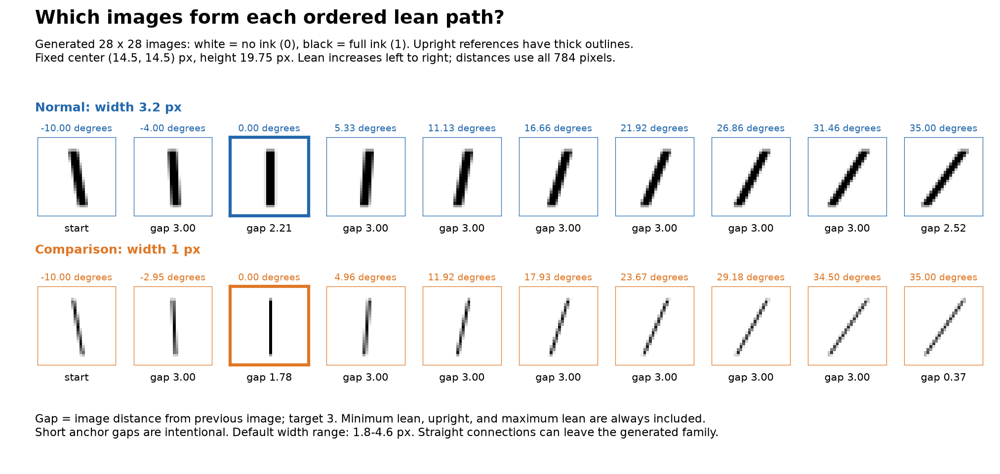
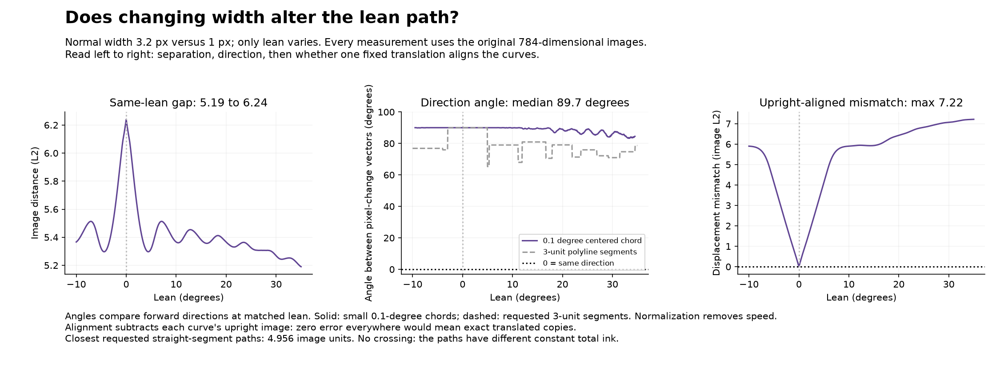
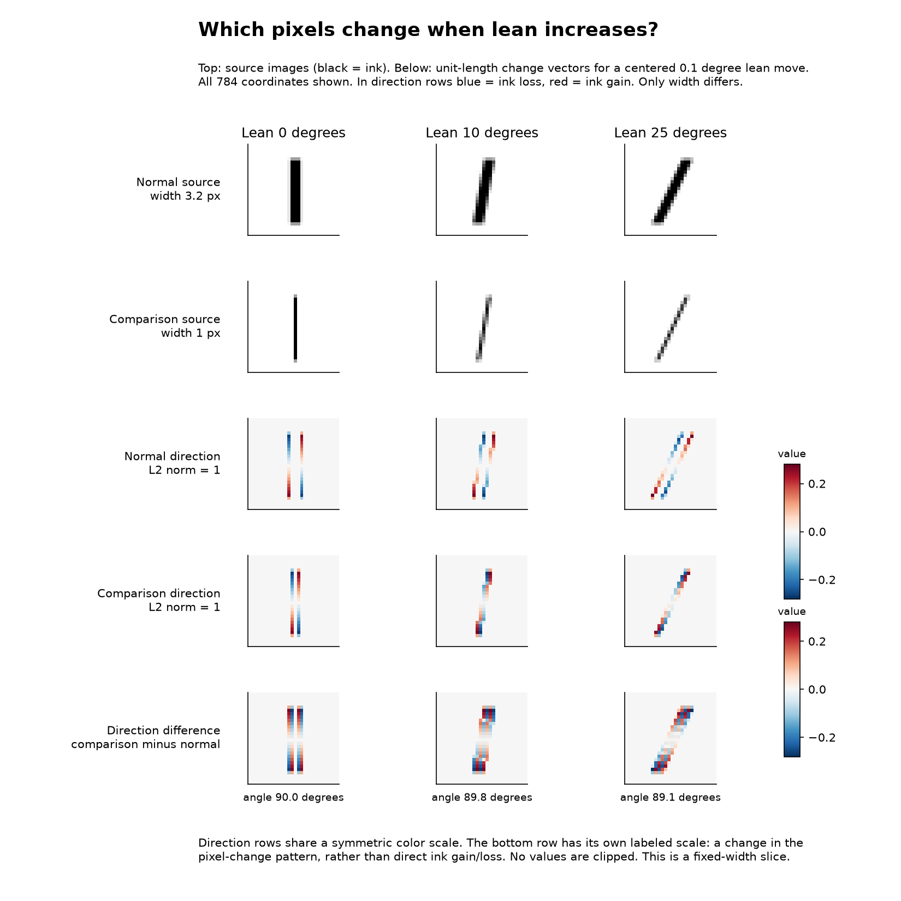

> Historical run: this used absolute width 1 pixel. The user clarified that they meant an increase of the width knob. See the parent report for the corrected +0.1 sweep.

# Lean paths at normal and one-pixel width

This is the controlled `grey_ones.py` family, measured directly in its 784
ink-coverage coordinates. No PCA, learned embedding, or projection is used.

The second width is interpreted as **exactly 1 pixel wide**. It is outside the
usual width range 1.8-4.6 px, but the renderer supports it. A different meaning
of "one width unit" requires a different run; one pixel of width is not one
unit of image distance.

## Fixed settings and sampling

Parameter order is `(cx, cy, height, width, lean)`. Both curves use center
`(14.5, 14.5)` px and height `19.75` px. The reference width is `3.2` px and the
comparison width is `1` px. Both traverse lean from -10 to +35 degrees; the
upright image is lean zero. Positive lean tips the top rightward.

An image is a point in 784D. Each coordinate is ink coverage: 0 means no ink,
1 means full ink. Image distance is Euclidean distance over these coordinates.

From minimum lean, advance to the first image whose distance from the last
sample is 3. Include upright even if the last gap is shorter. Restart at
upright, advance in 3-unit distances, and include maximum lean even if the
last gap is shorter. Root finding follows a 0.025-degree scan to bracket the
first crossing; it does not assume global monotonicity of distance to a sample.

These are consecutive **chord** distances, not distances from the upright
image, not angular steps, and not 3 units of accumulated arc length.

Both paths have ten images. Normal lean values, rounded to degrees:
`-10, -4.00, 0, 5.33, 11.13, 16.66, 21.92, 26.86, 31.46, 35`.
Comparison lean values:
`-10, -2.95, 0, 4.96, 11.92, 17.93, 23.67, 29.18, 34.50, 35`.

All ordinary gaps equal 3 within 0.000002 image units. Forced shorter gaps
before upright and maximum lean are 2.210 and 2.522 for normal width, and
1.782 and 0.367 for comparison width.

## Distances and crossings

| Measurement | Result |
| --- | ---: |
| Distance at identical lean | 5.190-6.241 |
| Upright image distance | 6.241 |
| Minimum between connected straight-segment paths | 4.956 |
| Minimum in an all-pairs 0.05-degree rendered-image scan | 5.190 |
| Lean of closest rendered samples | both +35 degrees |
| Dense-sample Hausdorff distance estimate | 5.941 |
| Maximum mismatch after aligning upright origins | 7.215 |

The connected path minimum considers all 81 pairs of segments and solves each
box-constrained quadratic exactly, including endpoints and segment interiors.
The minimum occurs inside normal segment 8 and comparison segment 7 (zero-based).
The rendered-curve and Hausdorff results are dense-sample estimates, not proven
continuous extrema.

**Neither rendered curves nor their connected polylines cross.** Total ink is
constant along each curve: height times width, hence 63.2 versus 19.75. Linear
interpolation also preserves this total. Equal images would have equal total
ink, which is impossible. By Cauchy-Schwarz, every cross-curve distance is at
least `(63.2 - 19.75) / sqrt(784) = 1.5518`. Float32 rounding alters total ink
by less than 0.000001 in this run, far too little to affect this conclusion.
This argument relies on these unclipped fixed-height strokes.

Connected straight segments cut across the curved rendered path. They can
contain images outside the generator's family. The maximum sampled deviation
from each connected polyline is 0.820 for normal width and 1.264 for width 1.
That explains why the connected lines can come closer than the generated images.

## Comparing directions without mismatching samples

Compare each forward direction at the **same lean**, not at the same sample
index: independently chosen 3-unit steps have different angular endpoints.
At polyline vertices, use the outgoing segment (the final endpoint uses its incoming segment).
Small-step profiles cover -9.5 to +34.5 degrees so all tested windows stay in range;
polyline profiles cover the full -10 to +35 degrees.
Normalize the vectors before taking their dot product, so speed does not affect
the angle. Zero degrees means identical forward direction; 90 means orthogonal;
180 means opposite.

| Direction comparison | Range | Median |
| --- | ---: | ---: |
| Forward segments of the requested 3-unit polylines, matched by lean | 65.3-90.0 degrees | 78.7 degrees |
| Centered 0.1-degree pixel-change vectors, matched by lean | 83.2-90.0 degrees | 89.7 degrees |

The small-step angle at upright is 90 degrees. Using centered steps of 0.02,
0.5, and 1 degree gives medians 89.7, 89.6, and 89.4 degrees respectively. This
is robust to the tested finite-difference scale; the renderer is piecewise
smooth, so these are small-step approximations rather than a claim of a unique
derivative at every pixel-edge event.

The single minimum-to-maximum endpoint vectors make an angle of 43.5 degrees.
That global summary loses substantial turning along both curves.

The pixel maps explain the near-orthogonality: lean adds and removes ink at a
stroke's edges. Different widths put those edges on different pixels. The
semantic operation remains lean in both cases, while its direction in the
fixed pixel coordinate system changes strongly. This is a statement about
image geometry, not about a different semantic operation.

## Overall travel and intrinsic shape

Dense arc-length estimates are 28.769 for normal width and 27.967 for width 1,
only about 2.8% apart. Connected-polyline lengths are 25.732 and 23.148;
endpoint chords are 9.215 and 4.627. Neither curve is a straight line.
Arc-length refinement from 0.05 to 0.025 degree spacing changes each estimate
by less than 0.01%.

For an additional translation/rotation-invariant check, compute every pairwise
image distance on a matched 91-point lean grid. Fit one uniform scale from the
normal distance matrix to the comparison distance matrix. The best scale is
0.6147. The residual has 16.6% of the comparison matrix's Frobenius norm. Thus
the curves also differ in their internal distance pattern; one translation,
rotation, and uniform scale cannot explain them exactly under matched lean.
This is a matrix residual, not a reconstruction error or an angle.

## Useful next experiments

1. **Width sensitivity sweep:** use widths near 3.2 (for example 3.0, 3.1,
   3.2, 3.3, 3.4), then widen the sweep over the default box. Plot direction
   angles versus lean and width. The present large change to 1 px cannot establish
   whether tiny width moves also change directions strongly.
2. **Separate speed from bending:** measure image distance per degree and
   tangent turning per unit image arc length, with finite-step convergence.
   This distinguishes faster traversal from a differently shaped curve.
3. **Separate placement from shape:** retain matched-lean direction angles,
   but also compare pairwise distance matrices and a single rigid/similarity
   alignment fitted to the entire curve. Evaluate equal normalized arc-length
   correspondence separately; it asks a different question than matched lean.

All conclusions above concern these two fixed-center, fixed-height slices.
They do not establish behavior throughout the full five-knob family or provide
coordinates that decode the full family and joint knob changes.

## Reproduce and inspect

Run `python make_generated_lean_width_comparison.py --width 1` using the existing
Python environment. `--step` changes requested image spacing. The script uses
the actual Python renderer, not a JavaScript approximation.

- `results.json`: detailed metrics and sampling metadata.
- `sampled_points.csv`: ordered knob settings and measured gaps.
- `sampled_images.npz`: exact rendered samples and lean settings.
- `matched_lean_metrics.csv`: separation, aligned mismatch, and angle profiles.

Validation includes independent bounded optimization of every segment pair
(maximum distance discrepancy below 1e-14), crossing/parallel segment controls,
anchor and distance checks, conserved ink, and finite-step/arc-length refinement.
Figures were inspected after rendering for legibility and the repository's
understanding check: objects, units, starting reference, evidence, and slice limits.
