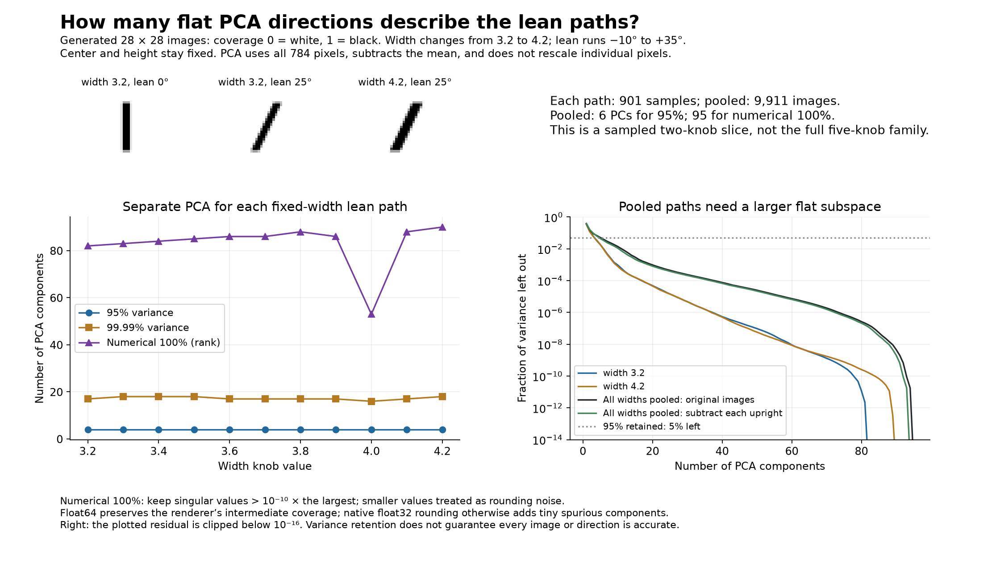

# PCA of width-dependent lean paths

Mean-centered, unstandardized 784 coverage pixels; float64 renderer arithmetic with unchanged 16 subrows. Exact cast agreement with native float32 renderer asserted.

Each dense path has 901 equally weighted lean samples from -10 to +35 degrees. Eleven widths from 3.2 to 4.2 in steps of 0.1 are pooled with equal weight. Center (14.5,14.5) and height 19.75 are fixed.

“100%” below means numerical affine rank at relative singular-value tolerance 1e-10, not an exact continuum proof. See JSON for tolerance sweeps, native float32 rounding ranks, and doubled-density checks.

| Data | Points | 95% | 99.99% | Numerical 100% |
| --- | ---: | ---: | ---: | ---: |
| width 3.2 | 901 | 4 | 17 | 82 |
| width 3.3 | 901 | 4 | 18 | 83 |
| width 3.4 | 901 | 4 | 18 | 84 |
| width 3.5 | 901 | 4 | 18 | 85 |
| width 3.6 | 901 | 4 | 17 | 86 |
| width 3.7 | 901 | 4 | 17 | 86 |
| width 3.8 | 901 | 4 | 17 | 88 |
| width 3.9 | 901 | 4 | 17 | 86 |
| width 4.0 | 901 | 4 | 16 | 53 |
| width 4.1 | 901 | 4 | 17 | 88 |
| width 4.2 | 901 | 4 | 18 | 90 |
| All widths pooled: original images | 9911 | 6 | 38 | 95 |
| All widths pooled: subtract each upright | 9911 | 5 | 37 | 94 |

## Original 3-unit chord samples

| Width | Points | 95% | Numerical 100% |
| --- | ---: | ---: | ---: |
| 3.2 | 10 | 4 | 9 |
| 3.3 | 10 | 4 | 9 |
| 3.4 | 10 | 4 | 9 |
| 3.5 | 10 | 4 | 9 |
| 3.6 | 10 | 4 | 9 |
| 3.7 | 10 | 4 | 9 |
| 3.8 | 10 | 4 | 9 |
| 3.9 | 10 | 4 | 9 |
| 4.0 | 10 | 4 | 9 |
| 4.1 | 10 | 4 | 9 |
| 4.2 | 10 | 4 | 9 |

Sparse ranks describe only the listed points, not the continuous lean path. Subtracting a single upright image before centering an individual path leaves its PCA unchanged; per-width subtraction changes the pooled data.

## Held-out pooled reconstruction

These images use intermediate widths and lean values absent from training. Errors are L2 in all 784 pixel coverage values.

| Components | Median error | Maximum error | Test energy lost |
| --- | ---: | ---: | ---: |
| 6 | 0.796852 | 1.75272 | 3.5693% |
| 38 | 0.0394941 | 0.184122 | 0.00871027% |
| 95 | 7.14211e-15 | 2.87128e-14 | 3.08216e-28% |

PCA dimension measures a global flat subspace. A fixed-width path still has one varying knob; the pooled width/lean slice has two. No full five-knob-family claim is made.

Reproduce: `OPENBLAS_NUM_THREADS=1 .venv/bin/python analyze_generated_lean_width_pca.py`.
