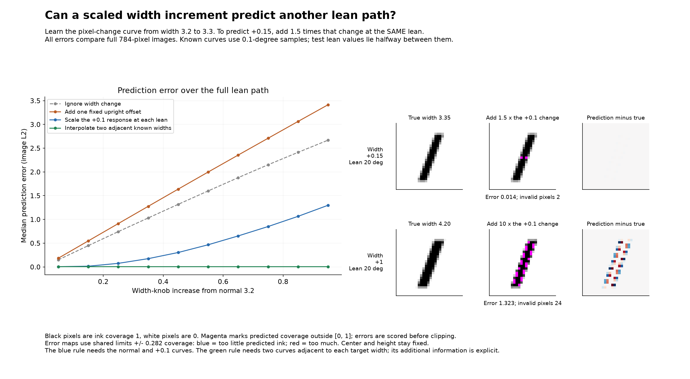

# Crossings and simple transformations between width-dependent lean curves

The attached graph is the previously generated direction-angle graph. Each plotted value is an angle to the normal-width lean tangent at the same lean. It is not an absolute orientation coordinate.

## Crossing questions

Centered lean step 0.1 degrees, sampled every 0.01 degree: 0 of 45 pairs show nontrivial order reversals. Largest numerical reversal is 0.000067 degrees. Near-zero overlaps below 0.5 degree and pair differences below 0.01 degree are excluded from crossing detection.
Centered lean step 0.02 degrees, sampled every 0.01 degree: 0 of 45 pairs show nontrivial order reversals. Largest numerical reversal is 0.000365 degrees. Near-zero overlaps below 0.5 degree and pair differences below 0.01 degree are excluded from crossing detection.

This is a dense numerical check on widths 3.3 to 4.2, not a proof of ordering at every possible width/lean. Curves can overlap in angle near upright and on plateaus without swapping order. Equal angles to a common reference generally do not determine identical 784D directions.
Actual rendered curves and their connected polylines at different widths cannot intersect for these fixed unclipped strokes: total ink = height times width, different for every width. Coinciding images would require equal total ink.

## Transformation tests

All target images are scored at lean values between training samples. Fresh target width increases are +0.05, +0.15, ..., +0.95. One additional +1 test measures extrapolation from the +0.1 response.
An error fraction below 1 means better than ignoring width. It divides pooled prediction error by the true width-change magnitude; it is not error divided by the norm of the entire image.
The best scalar-plus-offset model uses target training samples to fit one scalar and one fixed 784-vector, so it is a favorable diagnostic of that model class, not a predictor learned without seeing the target width.

| Width increase | True gap, median | Fixed upright offset error | Best scalar + offset error | Scaled +0.1 response error | Adjacent-width interpolation error |
| --- | --- | --- | --- | --- | --- |
| +0.05 | 0.150 | 0.183 (114.5% of width effect) | 0.113 (78.1% of width effect) | 0.005 (5.4% of width effect) | 0.005 (5.4% of width effect) |
| +0.15 | 0.449 | 0.548 (114.0% of width effect) | 0.339 (78.1% of width effect) | 0.015 (4.6% of width effect) | 0.005 (1.7% of width effect) |
| +0.25 | 0.743 | 0.913 (113.7% of width effect) | 0.563 (77.9% of width effect) | 0.075 (12.4% of width effect) | 0.005 (1.0% of width effect) |
| +0.35 | 1.031 | 1.276 (113.4% of width effect) | 0.781 (77.7% of width effect) | 0.174 (18.9% of width effect) | 0.005 (0.7% of width effect) |
| +0.45 | 1.318 | 1.638 (113.1% of width effect) | 0.992 (77.4% of width effect) | 0.304 (24.6% of width effect) | 0.005 (0.5% of width effect) |
| +0.55 | 1.600 | 1.998 (113.0% of width effect) | 1.194 (77.0% of width effect) | 0.467 (29.7% of width effect) | 0.005 (0.4% of width effect) |
| +0.65 | 1.879 | 2.355 (112.9% of width effect) | 1.390 (76.6% of width effect) | 0.652 (34.5% of width effect) | 0.005 (0.3% of width effect) |
| +0.75 | 2.151 | 2.709 (112.9% of width effect) | 1.582 (76.1% of width effect) | 0.850 (39.0% of width effect) | 0.005 (0.3% of width effect) |
| +0.85 | 2.413 | 3.063 (112.9% of width effect) | 1.775 (75.6% of width effect) | 1.065 (43.2% of width effect) | 0.005 (0.3% of width effect) |
| +0.95 | 2.669 | 3.414 (112.9% of width effect) | 1.951 (75.0% of width effect) | 1.298 (47.3% of width effect) | 0.005 (0.2% of width effect) |
| +1.00 | 2.793 | 3.588 (113.0% of width effect) | 2.037 (74.7% of width effect) | 1.422 (49.3% of width effect) | known endpoint; not scored |

## A reusable nearby-width rule

At each lean, compute `width_step(lean) = curve_width_3.3(lean) - curve_width_3.2(lean)`. Then predict `curve_width_3.35(lean) approximately = curve_width_3.2(lean) + 1.5 * width_step(lean)`.
The same scalar 1.5 applies to the entire response curve. However, the response itself depends on lean. This is not one fixed 784-vector added to every point, and the approximate images need not satisfy the exact generator equation.
Extrapolating this +0.1 response by 10 times to +1 accumulates much larger error. Width effects are piecewise linear in raw coverage at a fixed lean, with slope changes when stroke edges cross pixel/subrow events. Interpolating neighboring known width curves handles those changes much better.

Reproduce with `python analyze_generated_lean_width_transforms.py`. This uses the actual Python renderer. The entire five-knob family is outside the test scope.

A supplementary rule clips scaled-response predictions to [0, 1]. It improves extrapolation, but does not establish membership in the generated family. Clipped-response metrics are also saved in results.json.
