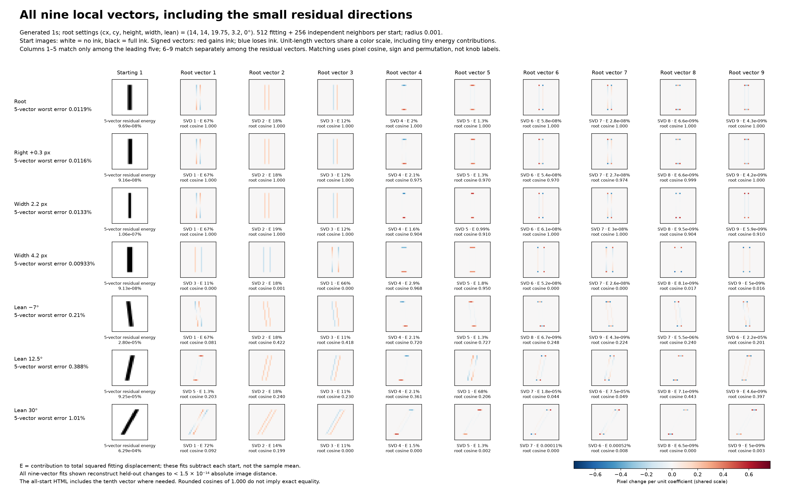
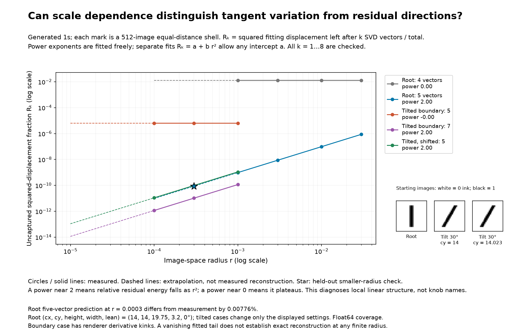
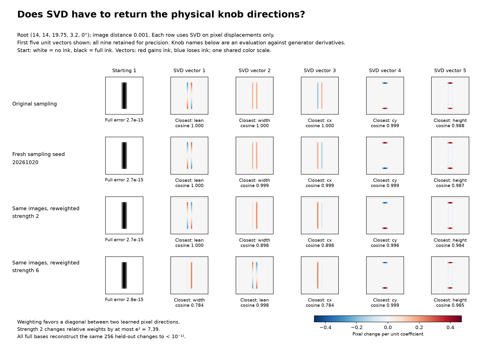

# Local basis follow-up: full vectors, scale laws and family matching

These experiments use the controlled generated-1 family from
[`grey_ones.py`](../../grey_ones.py), not MNIST. The canonical root settings are
`(cx, cy, height, width, lean) = (14, 14, 19.75, 3.2, 0)`.
An image is 784 ink-coverage numbers. Image distance is Euclidean.

## Full nine-vector view



[Open all 17 starts, including both ten-vector cases](all_starts_full_basis.html).
The gallery is self-contained and has a first-five/all-vectors toggle.

Every fit uses 512 training neighbors and 256 independently sampled checking
neighbors at image radius 0.001. SVD is applied to image-minus-start
displacements, without subtracting the sample mean or standardizing pixels.
Thus the reported energy is squared displacement about the start, rather than
the usual mean-centered PCA variance. Coverage is stored as float64 to study
geometry before default float32 output rounding.

The first five directions and residual directions are matched separately to
the root using absolute pixel cosine and a one-to-one assignment. Signs and
permutations are allowed. This display matching does **not** establish shared
physical knob meanings. Every displayed vector has unit length and uses a
shared signed color scale; tiny-energy residuals are deliberately enlarged.

| Start | Full local basis size | Held-out energy captured by five | Worst relative change error using five |
| --- | ---: | ---: | ---: |
| Root | 9 | 99.999999910252% | 0.0118844% |
| Lean 30 degrees | 9 | 99.999358587297% | 1.01483% |
| Spread 03 | 10 | 99.993232190212% | 1.37928% |

Across all 17 starts, full-basis held-out absolute L2 errors are below
`1.5e-14`. Full basis size uses the existing singular-value cutoff
`s_j / s_1 > 1e-10`, with held-out reconstruction checked separately.
All rows and the display order are recorded in
[`energy_and_errors.csv`](energy_and_errors.csv).

Nine vectors needed for a finite neighborhood are not nine independent
generator controls: curved changes and piecewise-smooth renderer effects can
occupy extra linear directions. The full local linear reconstruction is also
not a nonlinear decoder for the entire family.

## Is extrapolating to smaller radius reasonable?



For every candidate `k = 1..8`, compute
`R_k = sum(s_j**2 for j > k) / sum(s_j**2)`.
For a smooth, regularly sampled manifold, first-order tangent changes have
energy of order `r**2`, while normal curvature changes have energy of order
`r**4`. Their relative energy is therefore of order `r**2`. This motivates a
power law, rather than an exponential in radius. See Little, Jung and
Maggioni, [Multiscale Estimation of Intrinsic Dimensionality of Data Sets](https://cdn.aaai.org/ocs/950/950-4178-1-PB.pdf).

We fit both freely estimated log-log power laws and separate models
`R_k = a + b*r**2` whose intercept is unconstrained. Negative tiny fitted
intercepts are numerical fit residuals, not physical negative energy.
The root fits use radii 0.03, 0.01, 0.003 and 0.001. The two tilted diagnostic
cases use 0.001, 0.0003 and 0.0001. Curves and full fit coefficients are in
[`results.json`](results.json).

An exploratory rule chooses the first `k` whose measured log-log exponent
exceeds 1.5. This threshold is not a calibrated general-purpose dimension
estimator and there are no uncertainty bounds in this small experiment.

| Case | Candidate `k` | Measured exponent | Interpretation |
| --- | ---: | ---: | --- |
| Root | 4 | 0.000047 | A nonzero fraction remains |
| Root | 5 | 1.99995 | Residual fraction falls approximately as radius squared |
| Tilt 30 degrees, cy=14 | 5 | -0.00106 | First-order residual remains |
| Tilt 30 degrees, cy=14 | 7 | 2.00003 | Seven linear directions capture the limiting first-order variation |
| Tilt 30 degrees, cy=14.023 | 5 | 2.00000 | The smooth nearby case returns five |

The tilted `cy=14` case has a derivative kink at a renderer subrow boundary;
moving down by 0.023 pixels removes that specific boundary. The generator
still has five controls. At a kink, the union of different one-sided tangent
directions can span more than five linear dimensions.

The root five-vector fit predicts `R_5 = 8.72345119e-11` at an unused radius
0.0003. The new measurement is `8.72277468e-11`: relative prediction error
0.0077557%. The check uses the same directional sampling design as the fitted
scales, at a new radius; it is not a new sampling-distribution test.
Only extrapolation segments are dashed. A predicted vanishing residual is
evidence of limiting local structure, not proof of numerical-precision
reconstruction at finite radius or identification of physical knobs.

## Can SVD return mixed knobs?



Yes. Even the original SVD vectors are not exactly pure physical derivatives.
SVD vectors are orthogonal; physical knob effects need not be. At lean 30
degrees the vector assigned to vertical position has cosine only 0.441 with
that knob's derivative. One-to-one assignment alone must not be interpreted
as recovery of pure controls.

Three new direction-sampling seeds give similar root bases. Stability under
these seeds reflects the same underlying sampling distribution. It does not
establish that the physical axes are uniquely identifiable.

For a stronger counterexample, retain exactly the same training images and
give larger weights to a diagonal between the original second and third
learned pixel directions. This operation uses no generator knob labels.
With weighting strength 2, the actual largest/smallest weight ratio is 6.49
(bounded by `exp(2) = 7.39`). The width/position directions become mixtures,
with assigned derivative cosines about 0.898 instead of above 0.999.
Strength 6 produces still stronger mixing. All full nine-vector fits continue
to reconstruct the same held-out displacements to below `1e-12` absolute L2.

An explicit 45-degree rotation of the original second/third vectors is also
saved. Rotating the coefficients along with the basis leaves reconstruction
unchanged to below `1e-15` per pixel. This gives another valid basis, although
it need not be the unweighted SVD basis.

Why did the original directions look like knobs? Locally the displacement
covariance is approximately `J C J.T`, where `J` contains generator
derivatives and `C` describes sampled parameter steps. Near the upright root,
the physical directions are nearly orthogonal and the sampling produces
separated eigenvalues. That makes SVD's preferred axes resemble those knobs.
Changing step scales, correlations, or sampling weights can rotate the axes.
No knob labels enter the SVD, but the controlled neighborhood sampling is
still a choice, rather than information-free recovery.

## Associating a family across starts

Direct pixel cosine is a weak semantic comparison when the stroke moves or
tilts. This experiment instead measures each direction's first-order effect
on six observable image quantities: ink mass, horizontal/vertical centroid,
horizontal/vertical variance, and cross-covariance.

Each quantity is scaled by its standard deviation over the 17 start images.
The resulting six-number effect profile is normalized to unit length. Match
the candidate profiles to root profiles by absolute cosine and a one-to-one
assignment. Candidate vector orders and signs are independently scrambled
before matching. No generator derivatives or labels enter this matching.

For evaluation only, independently assign the five SVD vectors at each start
to the five known generator derivatives. Against these assignment labels,
observable matching agrees on **80/80** non-root vectors, versus **59/80** for
direct pixel matching. This result establishes consistent matching of the
assigned categories in these samples. It does not establish that all vectors
are pure knob derivatives, nor that another sampling distribution would
produce the same categories. The chosen image observables encode human
knowledge about geometric shapes.

For more general data, aligning neighboring local frames and enforcing
smoothness is a related approach; [Vector Diffusion Maps and the Connection
Laplacian](https://arxiv.org/abs/1102.0075) develops such vector-field machinery.
Frame alignment can involve a full orthogonal rotation, not just reordering
and sign changes. Selecting individual physical controls still requires
additional structure. It is also a separate problem to integrate the local
directions into coordinates with a decoder that passes joint-change tests.

## Reproduce and inspect

From the repository root:

```bash
OPENBLAS_NUM_THREADS=1 .venv/bin/python analyze_generated_one_basis_followup.py
```

The script reads the saved samples from the
[`across-start experiment`](../generated_one_local_bases_across_starts/README.md)
and the [`root experiment`](../root_one_local_svd/README.md). It generates new
root sampling seeds and the smaller-radius check, but otherwise reuses data.

- `results.json`: matching assignments, bias experiments, scale fits, and all-start energy/errors.
- `alternative_bases.npz`: fresh-seed and reweighted bases, rotation matrix, weights and held-out coefficients.
- `smaller_radius_check.npz`: settings, images and spectrum for the unused radius 0.0003.
- Original complete basis/sample archive: `../generated_one_local_bases_across_starts/bases_and_samples.npz`.

Source: [`analyze_generated_one_basis_followup.py`](../../analyze_generated_one_basis_followup.py).
