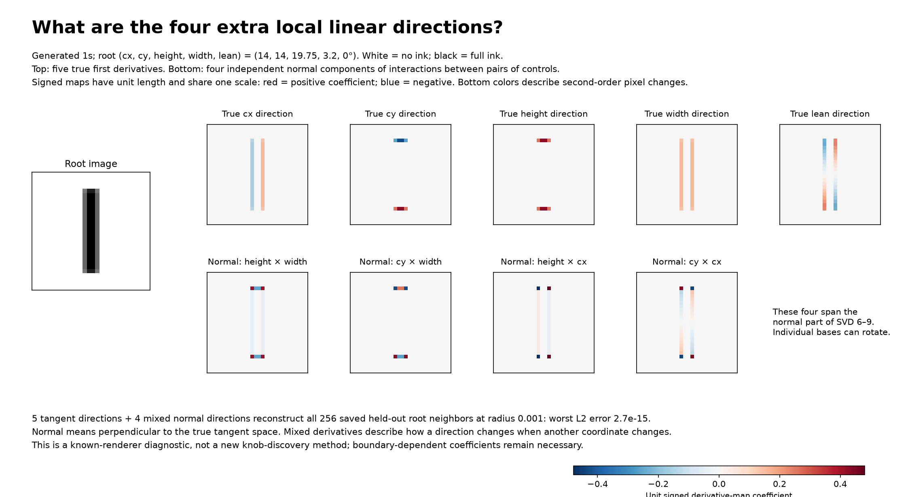

# Knob families as vector fields: geometry, exact interactions, and ambiguity

This is an analytic diagnostic of the known five-control generated-1 renderer,
not discovery from unlabeled images. Root settings are
`(cx, cy, height, width, lean) = (14, 14, 19.75, 3.2, 0)`.
All errors use float64 coverage and Euclidean image distance over 784 pixels.

## Overlap is measured, not just a theoretical possibility

Compute the five true derivatives as columns of `J`, and normalize them only
for measuring angles. Their signed cosine Gram matrices are in `results.json`.

| Start | Horizontal/vertical position cosine | Height/width cosine |
| --- | ---: | ---: |
| Root | 0 | 0.144059 |
| Lean -7 degrees | -0.258962 | 0.143930 |
| Lean 12.5 degrees | 0.459846 | 0.147867 |
| Lean 30 degrees | 0.788879 | 0.103566 |

The true Jacobian has rank five at all four starts. Independence requires
rank five, not perpendicular columns. SVD can recover the span of overlapping
directions, but its orthogonal axes cannot all equal these true knob effects.

## What the four extra root SVD directions represent



Within a smooth patch, a five-coordinate decoder has expansion

`F(q+d) = F(q) + J(q)d + 1/2 H(q)[d,d] + ...`.

The components of `H[d,d]` perpendicular to the tangent space describe bending
out of the linear tangent approximation. These are extra pixel-space linear
directions, not extra independent controls. Their coefficients depend on the
same five coordinates.

For the canonical root, the analytic mixed derivatives have a four-dimensional
normal span. Four concrete generators of it are the normal components of
height/width, vertical-position/width, height/horizontal-position, and
vertical-position/horizontal-position interactions. The figure shows these
four concrete derivative maps, not a claim that SVD must select that basis.

Five analytic tangent directions plus these four normal directions reconstruct
the 256 previously saved held-out neighbors at image radius 0.001 with worst
absolute L2 error **2.69e-15**. After projecting away the true tangent part,
the original SVD vectors 6-9 lie in this mixed normal space to within
`6.4e-9` in unit-vector L2; normalizing tiny singular directions amplifies
roundoff. Their original tangent fractions are about `5e-6`.

The root lies at vertical subrow boundaries. Its first derivatives agree
between sides at zero lean, but its mixed second derivatives need not.
The diagnostic uses averaged one-sided cap derivatives to obtain the common
interaction span. This does not assert a unique smooth Hessian at that root.
At tilted boundary starts, additional first-order, rather than merely
second-order, directions can occur. The root explanation must not be extended
unchanged to all starts.

## A precise mathematical property in the earlier height/width experiment

At fixed center `(14,14)` and zero lean, the image is an outer product:

`F(h,w) = B(h) outer A(w)`.

For `18 < h < 20` and `2 < w < 4`, both profiles are affine. Hence

`F = C + h*U + w*V + h*w*D`,

with fixed pixel arrays, and

`J_height(w+dw) - J_height(w) = dw*D`.

The change in the unnormalized height direction is the same vector at every
height and width in this patch. Its L2 norm is `0.5*abs(dw)` per pixel of
height increment. Across 37 widths spaced by 0.05 and four heights, the mixed
derivative varies by at most `3.6e-14`; equal 0.05 width steps change the
height derivative by L2 **0.025**.

The finite four-corner interaction is exactly `dh*dw*D`. For `dh=0.03`,
`dw=0.02`, its L2 norm is **0.0003**, checked against the Python renderer.
Crossing into another pixel formula region changes `D`; the height 20.1
control in the JSON explicitly demonstrates the failure of the same invariant
outside this patch. Unit-normalizing the derivative also changes this law.

This constant mixed derivative is stronger evidence of a shared local
coordinate family than approximate vector-angle matching. It is an exact
patch property, not a unique identifier of the physical knobs.

## Geometric transport: what it supplies and what it does not

An induced metric defines Levi-Civita parallel transport along a specified
smooth path. It preserves lengths and angles. It need not carry a physical
knob direction into the same physical knob at the endpoint: the table above
already shows that their mutual angles change.

We also test this inside a single smooth renderer cell. Starting at
`(14.43,14.62,19.73,3.17,17.3)`, change width by 0.0025. Successive orthogonal
Procrustes maps between exact tangent frames approximate metric parallel
transport. Refinements from 16 to 64 to 256 steps agree to about `1e-13` in
the transported frame. They preserve the starting cosine Gram matrix, but
the true normalized knob Gram matrix changes by **0.000321265**. Therefore
even this short, smooth transport cannot reproduce all five true knob fields
exactly. No renderer kink is involved in that example.

See the author's [Riemannian geometry notes on metrics and connections](https://www.wim.uni-mannheim.de/media/Lehrstuehle/wim/schmidt/FSS2024/Riemannian_Geometry/Web/RGch3.html)
for metric compatibility and parallel transport. General transport can also
depend on the path; our numerical example stays on one specified path.

If a coordinate decoder `F(q)` is known instead, there is an exact coordinate
transport on regular tangent spaces:

`T(p -> q) = J(q) pinv(J(p))`.

It maps `J(p)e_i` to `J(q)e_i`, so it follows the same coordinate knob. It
can change lengths and angles. It composes consistently because
`pinv(J(q)) J(q) = identity`. This rule uses the chosen coordinate system;
it is not determined by the manifold's metric alone.

Using this known-control chart, we checked all five transported families at
14 saved starts. Maximum relative vector error was **2.25e-15**, and composing
through an intermediate chart versus transporting directly differed by at
most **9.1e-16** in any pixel derivative. The three explicitly tilted cap-kink
starts were excluded because a unique two-sided Jacobian need not exist
there; their finite coordinate paths are still well-defined.

## Root directions and commuting flows do not uniquely determine families

Here is an exact alternate coordinate chart:

`z_cx = cx`

`z_width = width + 2*(cx-14)^2`

Other coordinates are unchanged. Its inverse subtracts the same quadratic
term, so it describes exactly the same image family on the transformed domain.
Its coordinate-change Jacobian is the identity at `cx=14`, so **all five root
directions match the true controls exactly**. Nevertheless,

`V_z_cx = V_cx - 4*(cx-14)*V_width`.

At `cx=14.3`, this alternate position direction has cosine **0.857493** with
the original position direction. All five alternate fields commute, since
they are coordinate vector fields. Joint coordinate moves reach the same
endpoint in either order. On 256 sampled states, coordinate round trips and
image round trips are exact in the executed float64 arithmetic; the tested
two update orders agree exactly.

The formula is the substantive evidence, rather than the finite check:
it constructs different families with identical root directions, the same
manifold, and exact decoding. Knowing the full embedded manifold rather
than a finite cloud does not remove this coordinate ambiguity. One can still
choose useful mathematical families, but identifying the original physical
families requires a selection principle beyond those conditions.

Commutation remains a valuable consistency test: a full independent smooth
frame with vanishing Lie brackets gives local coordinates. It is necessary
for fixed-calibration coordinate fields, not for arbitrary unit-normalized
versions of those fields. See the [MIT notes on vector fields and
integrability](https://math.mit.edu/classes/18.966/2014SP/965/class4.pdf).

## Exact five-coordinate curved reconstruction inside a cell

Use coordinates `(top, bottom, intercept, width, slope)`, where

`top = cy-height/2`, `bottom = cy+height/2`,

`slope = tan(lean)`, `intercept = cx+slope*cy`.

In a fixed renderer formula cell, each vertical subrow weight is affine in
top/bottom, and each horizontal overlap is affine in intercept/width/slope.
Their product is quadratic. Consequently the five-coordinate decoder is an
**exact degree-two polynomial within that cell**, rather than an arbitrary
approximation justified by variance percentage.

At the generic smooth start above, check all 32 corners of a coordinate box
with half-spans `(0.00025,0.00025,0.00025,0.00025,0.000025)`. They share the
same affine formula signature. The cell inequalities are linear in these
coordinates, so the box remains in that cell. The analytic quadratic decoder
reconstructs 1,024 new joint settings with worst image L2 error **1.55e-14**;
the corresponding linear decoder has worst error **2.85e-7**.

The polynomial identity is a structural statement about this renderer;
the numerical checks measure its floating-point evaluation accuracy. It is
local, uses known coordinates, and does not discover a global chart from
images. Crossing formula boundaries requires the appropriate piecewise
decoder and consistent joins.

## Reproduce

```bash
OPENBLAS_NUM_THREADS=1 .venv/bin/python analyze_generated_one_manifold_transport.py
```

- Source: [`analyze_generated_one_manifold_transport.py`](../../analyze_generated_one_manifold_transport.py).
- [`results.json`](results.json): all measurements and method definitions.
- `analytic_geometry.npz`: analytic Jacobians, mixed derivatives, spans, and joint decoder checks.
- Existing root data: `../generated_one_local_bases_across_starts/bases_and_samples.npz`.

The figure was inspected after rendering. Source images, units, common signed
color scale, normalization, distinction between first/second derivatives,
measured reconstruction error, and known-renderer scope are stated on it.
