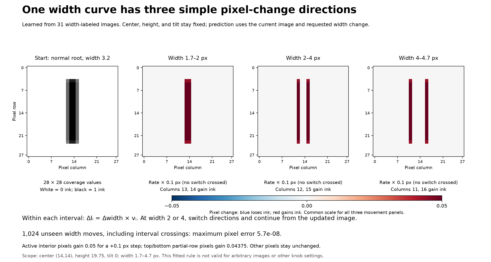

# A width movement equation learned from image differences

This first test covers one width curve: center `(14,14)`, height 19.75, tilt 0 remain fixed.
Width ranges from 1.7 to 4.7 px. These fixed settings describe the source data; they are not inputs to the learned prediction function.



## What was learned

I used 31 width-labeled images sampled every 0.1 px. Consecutive pixel differences divided by the width step revealed three constant movement vectors, with switches at widths **2 and 4**.
The switches were detected where the observed secant directions changed, not supplied from the renderer's geometry.
A piecewise-linear model then fitted all 784 coefficient curves from those image values and width labels.

The prediction function uses **current image I and requested width change δ**, together with the learned fixed model parameters.
It does not call the renderer, infer centers/tilts/edges, or construct a parallelogram.

## The per-pixel direction equation

Let pixel `i = 28r + c`, with rows and columns numbered from zero. The learned common row factors are

\[
b_r=\begin{cases}
0.875,&r=4\text{ or }23,\\
1,&5\le r\le22,\\
0,&\text{otherwise}.
\end{cases}
\]

The three learned directions, in coverage change per pixel of width, are

\[
v_{0,i}=\tfrac12 b_r\,\mathbf1_{c\in\{13,14\}},\quad
v_{1,i}=\tfrac12 b_r\,\mathbf1_{c\in\{12,15\}},\quad
v_{2,i}=\tfrac12 b_r\,\mathbf1_{c\in\{11,16\}}.
\]

Here the indicator is 1 for a listed column and 0 otherwise. These support patterns and values were read from the measured pixel differences.
The local width direction is

\[
V_i(I)=\begin{cases}
v_{0,i},&1.7\le\hat w(I)<2,\\
v_{1,i},&2<\hat w(I)<4,\\
v_{2,i},&4<\hat w(I)\le4.7.
\end{cases}
\]

At the two switching widths, the left and right derivatives differ. The finite-step equation below handles either direction and avoids choosing an ambiguous derivative.

## Reading the current curve coordinate from the image

The width labels also revealed a linear relation between total ink and width:

\[
\sum_i I_i\approx a+m w,\qquad a\approx0,\quad m\approx19.75.
\]

Both a and m were fitted from the image data. Therefore

\[
\hat w(I)=\frac{\sum_i I_i-a}{m}.
\]

This is a calibrated observable coordinate on this one curve. The slope numerically equals its fixed height, but no height value is supplied to prediction.
This relation is not a width estimator for arbitrary images: changing height changes the calibration.
If the current width is already known, use it directly instead of estimating it from I.

## One finite-step equation, including crossings

Let \([z]_+=\max(0,z)\), \(w=\hat w(I)\), and let δ be the requested width change. Define

\[
H_t(w,\delta)=[w+\delta-t]_+-[w-t]_+.
\]

Then every signed pixel change is

\[
\boxed{\Delta I_i=\delta v_{0,i}
+H_2(w,\delta)(v_{1,i}-v_{0,i})
+H_4(w,\delta)(v_{2,i}-v_{1,i}).}
\]

The output image is \(I'_i=I_i+\Delta I_i\).
The hinge terms allocate the correct portions of a movement to the appropriate direction. They handle widening, narrowing, and crossings without microscopic numerical steps.
The compact v vectors above are the rounded learned pattern; `model.npz` retains the actual least-squares fitted coefficients used for reported validation.

For example, pixel 152 is row 5, column 12. At width 3.2, a +0.1 move gives ΔI=+0.05.
At width 1.8, the same requested move gives that pixel ΔI=0; different columns are active there.
For a move from 3.9 to 4.2, that pixel gains 0.05 on the way to 4.0 and then stops changing; the next columns gain the rest.
Thus the same knob has different pixel effects depending on the current state.

## Validation

I tested 1,024 fresh start/end width pairs drawn continuously from 1.7–4.7 px; both endpoints were off the training grid.
The endpoints include widening, narrowing, and movement across either or both switches.
`grey_ones.render` was used only to provide validation ground truth, not in the prediction rule or the fit from saved images.

| Check | Maximum error |
| --- | ---: |
| Held-out pixel coefficient | 5.74e-08 |
| Held-out 784D image L2 | 3.45e-07 |
| Return loop 3.2 → 4.4 → 1.8 → 3.2, per pixel | 1.83e-09 |

This agrees with the original renderer to float32 precision on this slice.

## What remains unsolved

This is a field along **one curve**, not a width field over the whole five-knob family.
Passing a tilted or shifted image to the same frozen model is not valid. To test this limitation, I reused the rule for a +0.1 width move:

| Initial context | Image L2 prediction error |
| --- | ---: |
| Same upright slice | 3e-07 |
| Tilt 10° | 0.363 |
| Height 20.5 | 0.028 |
| Horizontal center 14.5 | 0.313 |

The more general challenge is to learn how the width direction changes across those other states; the successful one-curve model does not solve that problem by itself.
For now, we have an explicit, data-fitted per-pixel movement equation and a held-out reconstruction check for one knob with the others fixed.

## Files and reproduction

- `model.npz`: fitted pixel coefficient functions, knots, and image-coordinate calibration.
- `results.json`: numerical validation and scope.
- `width_movement_equation.png`: explanatory figure; SVG is the same figure.

From the repo root:

```sh
MPLCONFIGDIR=/tmp/generated-one-mpl .venv/bin/python experiments/learn_width_pixel_movement_20261009.py
```

The function `pixel_changes(image, width_change, model)` in that script performs prediction. Add its output to the input image to obtain the new image.
