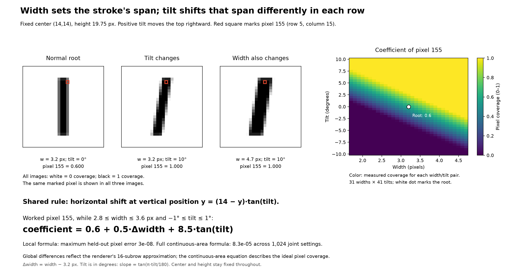

# Pixel coefficients as functions of width and tilt

The root is `(cx, cy, height, width, lean) = (14, 14, 19.75, 3.2, 0)`.
Center and height stay fixed. Width varies **1.7–4.7 px every 0.1 px** (31 widths).
Tilt varies **−10° to +10° every 0.5°** (41 tilts). Positive tilt moves the top rightward.
These are experimental settings; the width range extends slightly beyond the usual defaults.
Pixels use zero-based row `r`, column `c`, and number `i = 28r + c`. Coefficients mean fractional ink coverage, from 0 to 1.



## Main result: one shared profile with a row-dependent shift

For height and width with zero tilt, a row factor and a column factor multiply.
Tilt adds a dependence of horizontal position on vertical position.
Use slope \(s=\tan(\pi\theta/180)\) for tilt \(\theta\) in degrees.
At vertical position \(y\), the stroke's horizontal center is

\[
\boxed{m(y)=14+(14-y)s.}
\]

This is a shear: points near the center barely move, and points near the ends move further.
At \(y=5.5\), a slope change shifts the center by \(8.5s\); at \(y=22.5\), the shift is \(-8.5s\).
Width changes the horizontal span around that shifted center. The same horizontal coverage profile applies at every vertical position, translated by this shared shift rule.

## A local coefficient equation, checked from image values

For pixel **155**, row 5, column 15, while width is 2.8–3.6 px and tilt is −1° to +1°:

\[
\boxed{a_{155}(w,\theta)=0.6+0.5(w-3.2)+8.5\tan(\pi\theta/180).}
\]

The coefficient's signed change from the root is \(0.5\Delta w+8.5s\).
Pixel 155 sits on the right edge in this region. Width adds coverage with slope 1/2.
The tilt coefficient 8.5 is its row midpoint's distance from the vertical center, with the appropriate sign.
Its mirrored left-edge pixel at row 5, column 12 has the opposite tilt sign:

\[
a_{152}=0.6+0.5\Delta w-8.5s.
\]

At row 22, the right-edge tilt sign also reverses: \(a_{631}=0.6+0.5\Delta w-8.5s\).
Thus tilt gains ink on one side and loses it on the other, with the amount controlled by row position.
This relationship is linear in **slope s**, not exactly linear in angle in degrees.

I fit pixel 155 from 289 rendered width/tilt pairs using terms `[1, Δw, s, Δw·s]`.
The fitted coefficients were `[0.6, 0.5, 8.49999993, -2.29758639e-07]`. The expected values are `[0.6, 0.5, 8.5, 0]`.
The width/slope interaction coefficient is at numerical-noise scale in this particular coverage region.
On **1,024 fresh local joint settings**, the explicit equation's maximum pixel error was 2.98e-08.
This affine equation stops applying when an edge leaves the pixel or the pixel saturates; do not extrapolate it across the entire sweep.

## General local rule by pixel position

The fixed stroke occupies vertical coordinates \(T=4.125\) through \(U=23.875\).
For row r, use \(\ell=\max(r,T)\), \(u=\min(r+1,U)\), visible row length \(v=\max(0,u-\ell)\), and midpoint \(\bar y=(\ell+u)/2\).
When the right edge stays inside column c over the whole visible row segment and the left edge stays to its left:

\[
a_{r,c}=v\,[14+w/2-c+(14-\bar y)s].
\]

When the left edge stays inside the column and the right edge stays to its right:

\[
a_{r,c}=v\,[c+1-14+w/2-(14-\bar y)s].
\]

Fully covered pixels have coefficient v; untouched pixels have coefficient zero.
The coefficient patterns are therefore determined by pixel position and which coverage case the pixel occupies.
Transitions occur when an edge crosses a pixel boundary. Rows near the ends cross boundaries sooner for the same tilt change.

## A full coefficient equation across transitions

The horizontal edges are

\[
L(y)=14-w/2-s(y-14),\qquad R(y)=14+w/2-s(y-14).
\]

Define the clipped ramp \(C(z)=\min(1,\max(0,z))\). Then the **ideal continuous-area** pixel coefficient is

\[
\boxed{a_{r,c}(w,s)=\int_\ell^u
\big[C(R(y)-c)-C(L(y)-c)\big]\,dy.}
\]

Rows with no visible interval have coefficient zero. The full image is \(\sum_{r,c}a_{r,c}E_{28r+c}\).
This combines one-dimensional edge responses using pixel position, width, and slope; it does not invert knobs or call a renderer to predict a pixel.

The integral also has a closed form. Let

\[
G(z)=\tfrac12\big([z]_+^2-[z-1]_+^2\big),\quad [z]_+=\max(0,z),
\]

\[
q_\ell=\ell-14,\quad q_u=u-14,\quad A=14+w/2-c,\quad B=14-w/2-c.
\]

For \(s\ne0\):

\[
\boxed{a_{r,c}=
\frac{G(A-sq_\ell)-G(A-sq_u)-G(B-sq_\ell)+G(B-sq_u)}{s}.}
\]

At \(s=0\), take the limit:

\[
a_{r,c}=v\,[C(A)-C(B)].
\]

The implementation integrates positive linear pieces as exact triangles/trapezoids, avoiding cancellation near zero slope. It does not sample subrows.
This is a mathematical area relationship, not an independently learned global model; the local regression is a separate image-data check.

## Verification and the renderer's precision

The continuous formula was checked on all **1,271 grid images** and **1,024 fresh jointly varying width/tilt settings**, with both inputs continuous and off the original grid.
Predictions used the analytic formula; `grey_ones.render` supplied ground truth only.

| Check | Result |
| --- | ---: |
| Maximum pixel error on the grid | 8.6e-05 |
| Maximum pixel error on fresh joint settings | 8.32e-05 |
| Maximum 784D image error on fresh joint settings | 0.000258 |
| Pixel 2.53e-06 on fresh joint settings | 2.53e-06 |
| Local pixel 155 maximum error | 2.98e-08 |

The global formula is exact for ideal continuous pixel areas. **It is not bit-for-bit exact for the existing renderer**, which uses 16 midpoint subrows per pixel row.
Within a wholly linear coverage case, midpoint averaging is exact up to float32 storage; across edge transitions, numerical quadrature explains the small global discrepancy.
This distinction matters: the height/width equation agreed at float32 precision everywhere because untilted coverage separated exactly.

## What differs from the height/width result

One row factor times one common column factor no longer reconstructs the tilted images: different rows have differently shifted profiles.
For width 3.2, the best rank-one approximation gives these relative image errors (residual Frobenius norm divided by image Frobenius norm):

| Tilt | Best rank-one relative error |
| --- | ---: |
| 0° | 1.01e-08 |
| 5° | 33.72% |
| 10° | 53.91% |

The replacement relationship is **a shared horizontal profile translated by a row-dependent shear**, followed by coverage integration.
Within one stable edge case, coefficients are affine in width and slope; a single global affine coefficient equation does not cover edge crossings.
Symmetry also survives: \(a_{r,c}(w,\theta)=a_{27-r,27-c}(w,\theta)\), and reversing tilt mirrors the image horizontally.
The horizontal tilt-reversal identity held exactly on this sampled float32 grid.

This is one analysis step for the fixed-center, fixed-height width/tilt slice. It does not establish coordinates for all five knobs.

Files: `width_tilt_pixel_relationship.png` (SVG is the same figure), `results.json`, and `samples.npz`.
Reproduce from the repository root:

```sh
MPLCONFIGDIR=/tmp/generated-one-mpl .venv/bin/python experiments/analyze_width_tilt_pixel_relationship_20261008.py
```
